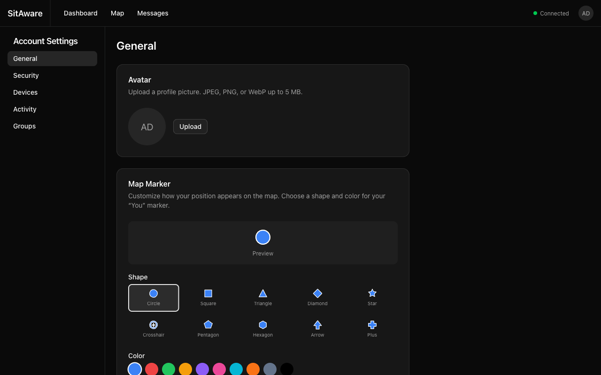
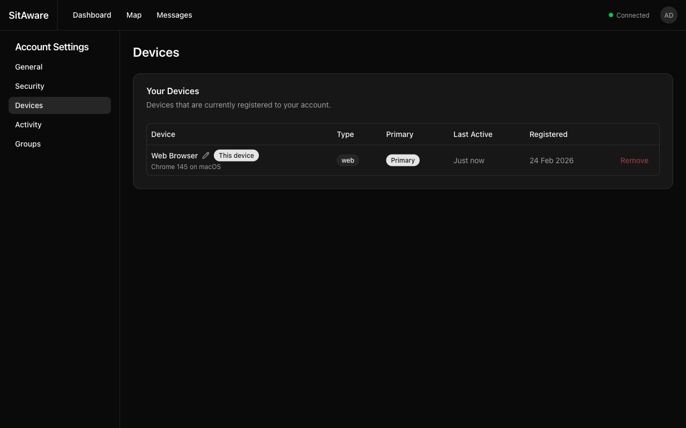

# Account Settings

Manage your profile, avatar, map marker appearance, devices, and view your activity log.

## Accessing Account Settings

Click your avatar/initials in the top-right corner of the navigation bar, then select **Account Settings**. The settings are organized into tabs in the left sidebar.

## General

### Avatar

Upload a profile picture that appears in the navigation bar, user listings, and message threads.

1. Click **Upload** next to your current avatar (or initials placeholder).
2. Select an image file (JPEG, PNG, or WebP, up to 5 MB).
3. The avatar is uploaded to the server and appears immediately.

### Map Marker

Customize how your position appears on the map.

**Shape** -- choose from 10 marker shapes:
- Circle, Square, Triangle, Diamond, Star
- Crosshair, Pentagon, Hexagon, Arrow, Plus

**Color** -- choose from 10 preset colors or enter a custom hex value (e.g., `#ff6600`).

A live preview shows how your marker will look. Click **Save Marker** to apply.

Your marker style is visible to all group members on the map.

### Profile

Update your display name and email address.

- **Username** is set by the admin at account creation and cannot be changed
- **Display Name** appears on the map and in messages (optional)
- **Email** is used for account identification

Click **Save Changes** to update.

## Security

See the dedicated [MFA Setup Guide](mfa-setup.md) for detailed instructions on multi-factor authentication.

### Changing Your Password

1. Enter your **Current Password**.
2. Enter your **New Password** (minimum 8 characters).
3. **Confirm** the new password.
4. Click **Change Password**.

### Multi-Factor Authentication

From this page you can:
- Add an **Authenticator App** (TOTP)
- Add **Security Keys & Passkeys** (WebAuthn/FIDO2)
- View and manage your registered MFA methods
- Regenerate recovery codes

## Devices

The Devices page shows all devices registered to your account.

### Device Information

Each device entry shows:
- **Name** -- the device name (auto-detected for web browsers, e.g., "Web Browser")
- **Type** -- web, mobile, radio, or tablet
- **Primary** -- indicates your primary device
- **Last Active** -- when the device was last used
- **Registered** -- when the device was first registered

### Renaming a Device

Click the pencil icon next to the device name, enter a new name, and confirm.

### Setting a Primary Device

Each user has one primary device. To change your primary device, click the action menu on the device you want to designate and select the primary option. The previous primary device is automatically demoted.

### Removing a Device

Click **Remove** to unregister a device. You cannot remove your current device (the one you are using right now).

> **Note:** Web browser devices are automatically registered when you log in. If you remove a web device and log in again from the same browser, it will be re-registered.

## Activity

The Activity page shows your personal audit log -- a record of every action you have performed in Vincenty.

Each entry includes:
- **Time** -- when the action occurred
- **Action** -- what you did (login, send message, update profile, etc.)
- **Resource** -- what was affected
- **IP Address** -- your IP at the time

You can export your activity log as **CSV** or **JSON** for your records.

## Groups

The Groups page shows all groups you are a member of, along with your permissions in each group:
- **Can Read** -- you can see group members' locations and messages
- **Can Write** -- you can send messages and share your location
- **Group Admin** -- you can manage members within the group
