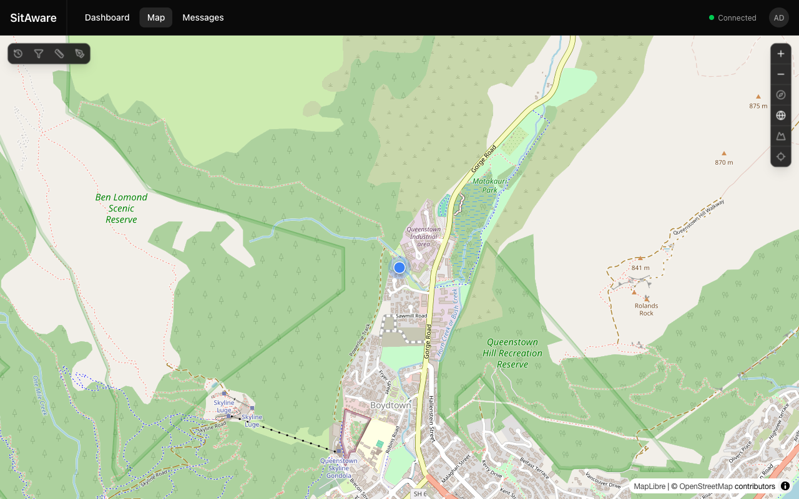
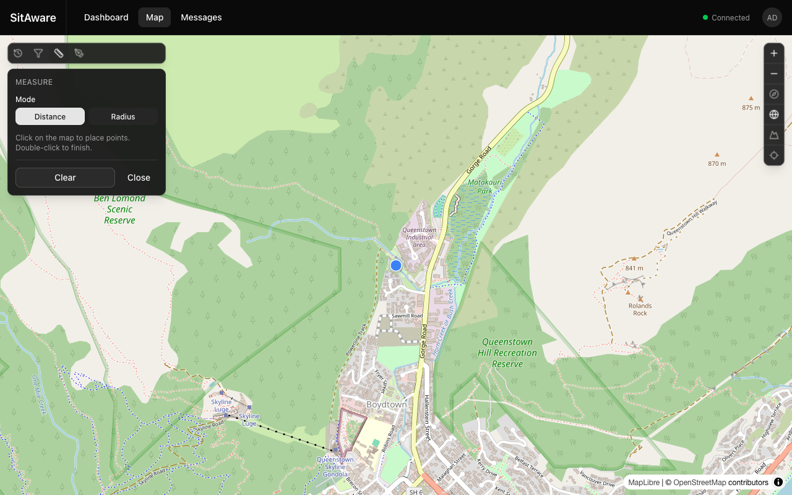
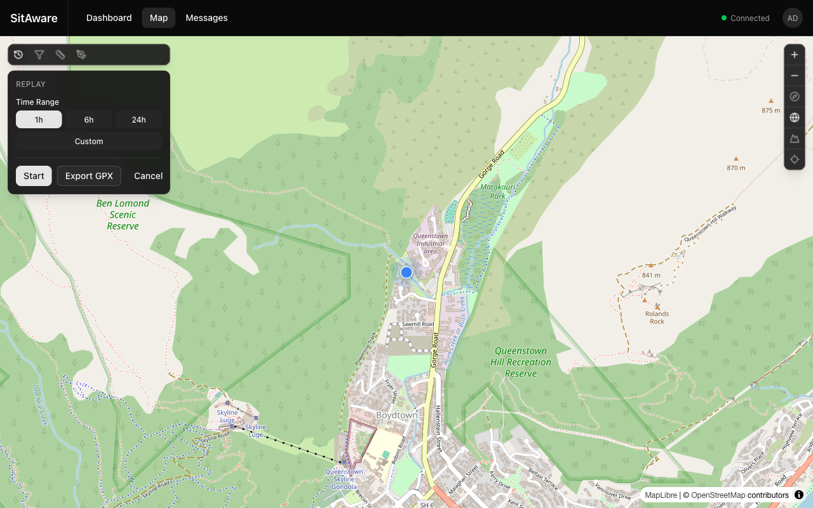

# Using the Map

The map is the core of Vincenty. It provides real-time situational awareness with location markers, drawing tools, measurement, replay, and GPX support.

## Map Overview

Navigate to **Map** in the top navigation bar.

The map displays:
- **Location markers** for all visible group members (updated in real-time)
- **Your position** as a distinct self-marker (blue dot by default)
- **Map attribution** in the bottom-right corner

## Map Controls

The right-side toolbar provides these controls:

| Button | Action |
|---|---|
| **+** / **-** | Zoom in / out |
| **Compass** | Reset the map bearing to north |
| **Globe** | Toggle between flat and globe projection |
| **Terrain** | Toggle 3D terrain elevation rendering |
| **Crosshair** | Center the map on your current location |

## Left Toolbar

The left-side toolbar provides access to advanced map features:

| Button | Description |
|---|---|
| **Replay** | Open the location history replay panel |
| **Filters** | Show/hide specific users or groups on the map |
| **Measure** | Open the measurement tool |
| **Draw** | Open the drawing tool |

## Drawing on the Map

Click the **Draw** button to open the drawing panel.

### Drawing Modes

| Tool | How to Use |
|---|---|
| **Line** | Click to place points. Double-click to finish the line. |
| **Circle** | Click to set the center, then click again to set the radius. |
| **Rect** | Click to set one corner, then click to set the opposite corner. |

### Styling

- **Stroke** -- choose from 10 color presets (red, orange, yellow, green, cyan, blue, purple, pink, white, black)
- **Fill** -- choose a fill color or select "No fill" for outlines only

### Saving and Sharing

Drawings are automatically saved to the server as GeoJSON. They can be shared with your group members, who will see them rendered as overlays on their maps.

## Measuring Distances

Click the **Measure** button to open the measurement panel.

### Measurement Modes

| Mode | How to Use |
|---|---|
| **Distance** | Click points on the map to create a path. The total distance is displayed. Double-click to finish. |
| **Radius** | Click a center point, then click to set the radius. The radius distance is displayed. |

Click **Clear** to remove all measurements, or **Close** to exit the tool.

## Replaying Location History

Click the **Replay** button to open the replay panel.

### How to Replay

1. Select a **Time Range** -- choose from quick presets (1h, 6h, 24h) or click **Custom** to set a specific date/time range.
2. Click **Start** to begin playback. Location tracks will be rendered on the map showing the movement paths.
3. Use the playback controls to pause, resume, or scrub through the timeline.

### Exporting GPX

Click **Export GPX** to download the location history for the selected time range as a GPX file. This can be opened in mapping applications like Google Earth, QGIS, or other GPS tools.

## GPX Overlays

When a GPX file is sent as a message attachment, it is automatically parsed and can be rendered on the map. GPX tracks, routes, and waypoints appear as overlays.

## Filtering Map Content

Click the **Filters** button to control what is visible on the map:
- Show/hide specific users' markers
- Show/hide specific group overlays
- Toggle drawing and track overlays

## Location Markers

Each user's position is shown as a marker with their username label. Marker appearance is customizable:
- **Shape** -- circle, square, triangle, diamond, star, crosshair, pentagon, hexagon, arrow, or plus
- **Color** -- 10 presets or custom hex color

Users customize their own marker in [Account Settings > General](account-settings.md). Group admins can set a default marker style for the group.

## Terrain and 3D View

Click the **Terrain** toggle to enable 3D terrain rendering. The map will display elevation data, giving a sense of the physical landscape. Click the **Globe** toggle to switch to a 3D globe projection.

Terrain sources are managed by administrators in [Server Settings > Map](admin-guide.md#map-configuration).
