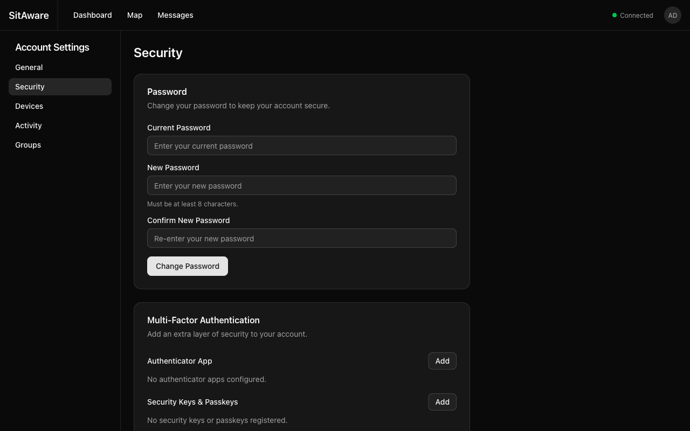

# MFA Setup

Multi-Factor Authentication (MFA) adds an extra layer of security to your Vincenty account. This guide covers setting up each available MFA method.

## Overview

Vincenty supports three MFA methods:

| Method | Description | Best For |
|---|---|---|
| **Authenticator App (TOTP)** | Time-based codes from apps like Google Authenticator | Most users -- works on any phone |
| **Security Keys & Passkeys (WebAuthn)** | Hardware keys (YubiKey) or biometrics (Touch ID, Windows Hello) | High security or passwordless login |
| **Recovery Codes** | 8 one-time backup codes | Emergency access when other methods are unavailable |

You can enable multiple methods simultaneously. Recovery codes are automatically generated when you set up your first MFA method.

## Accessing MFA Settings

1. Click your avatar in the top-right corner of the navigation bar.
2. Select **Account Settings**.
3. Click **Security** in the left sidebar.

## Setting Up an Authenticator App (TOTP)

1. In the **Multi-Factor Authentication** section, find **Authenticator App** and click **Add**.
2. A QR code will appear on screen.
3. Open your authenticator app (Google Authenticator, Authy, 1Password, Microsoft Authenticator, etc.) and scan the QR code.
4. The app will generate a 6-digit code that changes every 30 seconds.
5. Enter the current code in the verification field and click **Verify**.
6. If this is your first MFA method, you will receive **8 recovery codes**. **Save these immediately** -- they are shown only once.

### Using TOTP to Sign In

1. Enter your username and password as usual.
2. When prompted, open your authenticator app and enter the current 6-digit code.
3. Click **Verify** to complete sign-in.

### Removing TOTP

1. Go to **Account Settings > Security**.
2. In the Authenticator App section, click **Remove**.
3. Confirm the removal.

> **Warning:** If TOTP is your only MFA method and you remove it, MFA will be disabled on your account. If the server requires MFA, you will be forced to set it up again immediately.

## Setting Up a Security Key or Passkey (WebAuthn)

1. In the **Security Keys & Passkeys** section, click **Add**.
2. Your browser will prompt you to use a security key or biometric:
   - **Security Key**: Insert your YubiKey or other FIDO2 key and tap it
   - **Touch ID / Windows Hello**: Use your fingerprint or face
   - **Passkey**: Your browser may offer to create a passkey synced across your devices
3. Give the credential a descriptive name (e.g., "YubiKey 5", "MacBook Touch ID").
4. The credential is registered and ready to use.

### Enabling Passwordless Login (Passkeys)

If your credential supports discoverable credentials (passkeys), you can enable passwordless login:

1. After registering the credential, find it in the Security Keys & Passkeys list.
2. Toggle the **Passwordless** option.
3. Now you can sign in from the login page by clicking **Sign in with Passkey** -- no username or password required.

### iOS (Face ID / Touch ID)

The iOS app has native support for passkeys and WebAuthn:

- **Passkey login**: Tap **Sign in with Passkey** on the login screen. iOS will present a Face ID or Touch ID prompt. No username or password is needed.
- **WebAuthn MFA**: When prompted for MFA after a password login, select the WebAuthn option. Face ID or Touch ID authenticates automatically.
- **Credential registration**: In **Settings > Security > Security Keys & Passkeys**, tap **Add** to register a new credential using Face ID or Touch ID.

Passkeys created on iOS are synced via iCloud Keychain and work across your Apple devices. For passkeys to work in production, the server's `WEBAUTHN_RP_ID` domain must be listed in the app's Associated Domains entitlement (`webcredentials:<domain>`).

### Using a Security Key to Sign In

1. Enter your username and password as usual.
2. When prompted, insert/activate your security key or use biometrics.
3. Authentication completes automatically.

### Removing a Security Key

1. Go to **Account Settings > Security**.
2. In the Security Keys & Passkeys section, click the delete button next to the credential.
3. Confirm the removal.

## Recovery Codes

Recovery codes are your safety net when you lose access to your authenticator app or security key.

### How Recovery Codes Work

- **8 codes** are generated when you first enable MFA
- Each code can only be used **once**
- Codes are bcrypt-hashed in the database -- they cannot be retrieved later
- Store them somewhere safe (password manager, printed sheet in a secure location)

### Using a Recovery Code

1. On the MFA challenge screen during login, look for a **Use recovery code** option.
2. Enter one of your unused recovery codes.
3. Sign-in completes. That code is now permanently consumed.

### Regenerating Recovery Codes

If you have used several codes or suspect they have been compromised:

1. Go to **Account Settings > Security**.
2. Click **Regenerate Recovery Codes**.
3. **All existing codes are invalidated** and 8 new codes are generated.
4. Save the new codes immediately.

## Server-Wide MFA Enforcement

Your administrator may enable a server-wide policy that requires all users to set up MFA. When this is active:

- If you log in without MFA configured, you will be redirected to the MFA setup page
- You cannot access any other feature until at least one MFA method is active
- The enforcement applies to all users, including admins

See the [Admin Guide](admin-guide.md#server-security) for details on enabling this policy.

## Admin: Resetting a User's MFA

If a user loses access to all their MFA methods and recovery codes, an administrator can reset their MFA:

1. Go to **Server Settings > Users**.
2. Click the action menu (**...**) next to the user.
3. Select **Reset MFA**.
4. The user's TOTP methods, WebAuthn credentials, and recovery codes are all removed.
5. The user can log in with just their password and set up MFA again.
