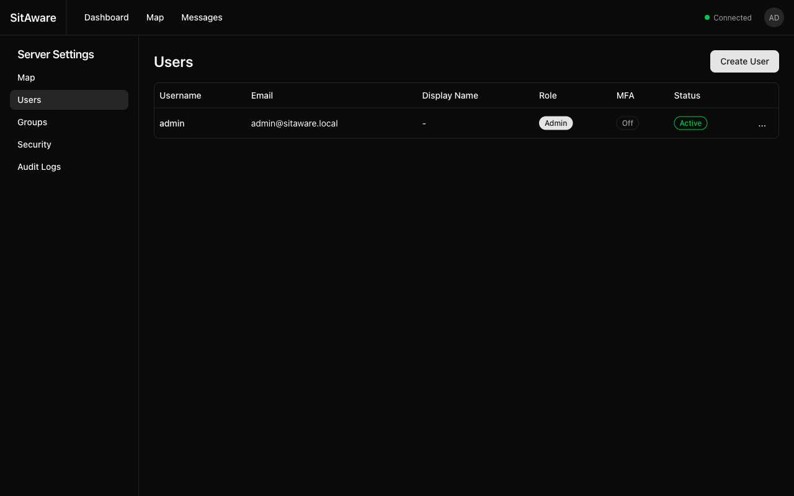
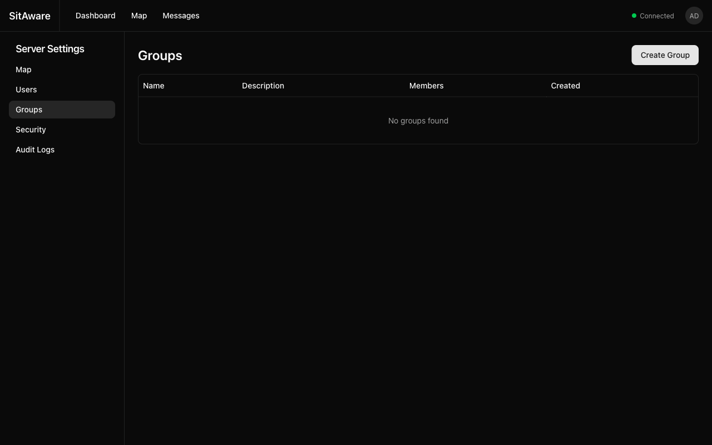
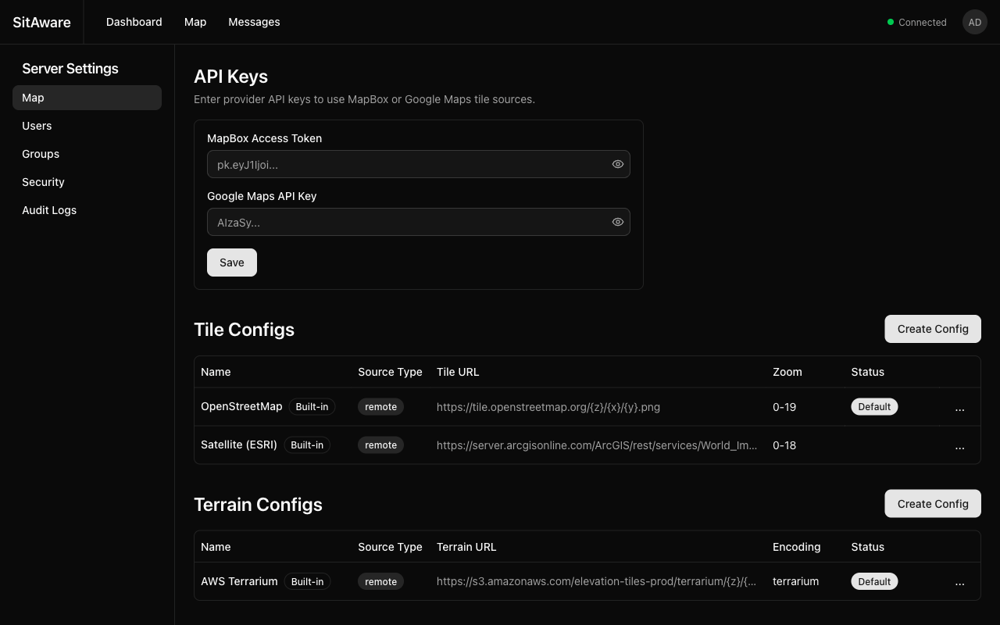
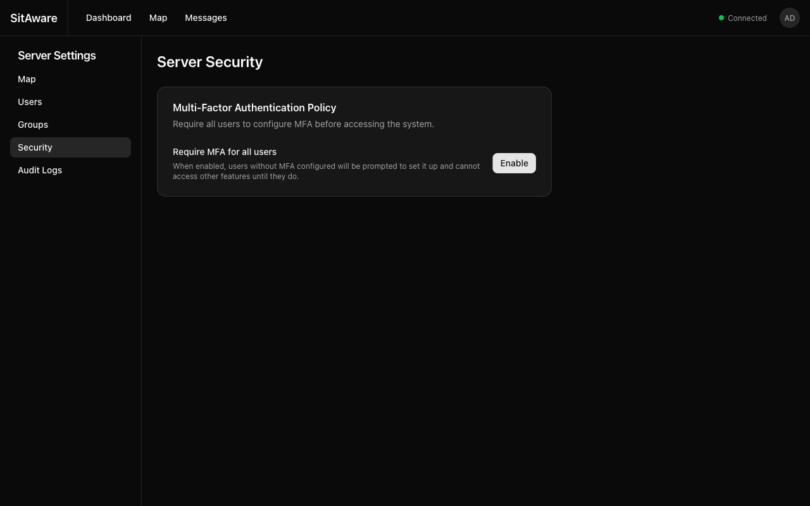
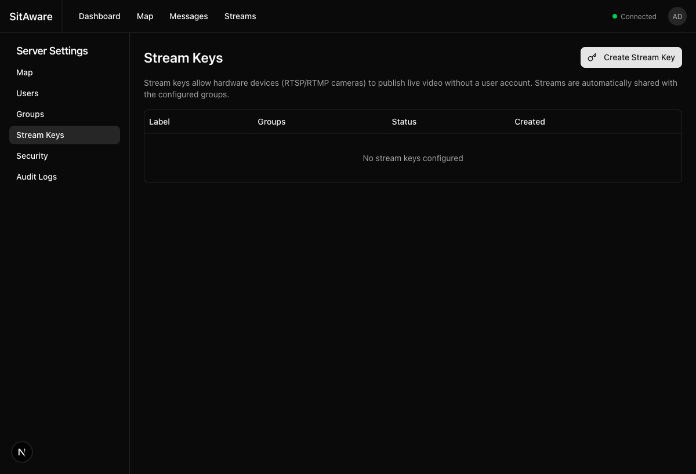
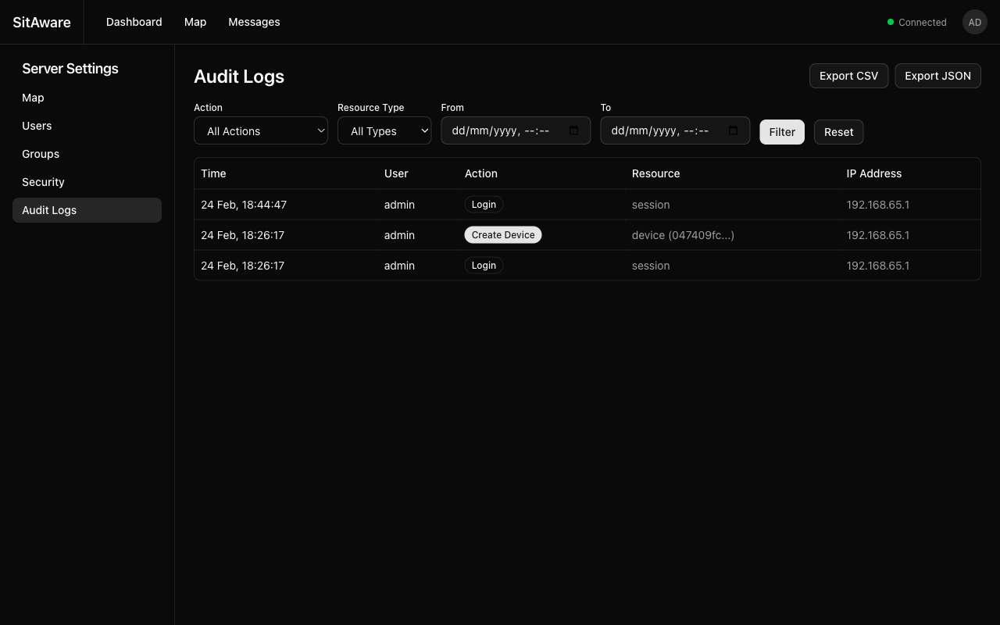

# Admin Guide

This guide covers server administration tasks: managing users, groups, map configuration, security policies, and audit logs.

## Accessing Server Settings

Server Settings are only visible to users with the **Admin** role.

1. Click your avatar in the top-right corner of the navigation bar.
2. Select **Server Settings**.

The settings are organized into sections in the left sidebar: Map, Users, Groups, Stream Keys, Security, and Audit Logs.

## User Management

### Viewing Users

The Users page shows all accounts on the server with:
- **Username** and **Email**
- **Display Name**
- **Role** -- Admin or User
- **MFA** -- whether MFA is enabled (On/Off)
- **Status** -- Active or Inactive

### Creating a User

1. Click **Create User** in the top-right corner.
2. Fill in the required fields:
   - **Username** -- unique, cannot be changed after creation
   - **Email** -- unique email address
   - **Password** -- minimum 8 characters
   - **Role** -- Admin or User
3. Click **Create**.

The new user can log in immediately with the provided credentials.

### Editing a User

1. Click the action menu (**...**) on the user's row.
2. Select **Edit**.
3. Update the desired fields (email, display name, role, active status).
4. Click **Save**.

> **Note:** You cannot demote or delete the last remaining admin account.

### Deactivating a User

Deactivating a user prevents them from logging in without deleting their data:

1. Edit the user.
2. Set **Status** to Inactive.
3. Save.

### Deleting a User

1. Click the action menu (**...**) on the user's row.
2. Select **Delete**.
3. Confirm the deletion.

> **Warning:** Deleting a user removes their account and cascades to their devices, group memberships, and other associated data. Messages sent by the user are retained.

### Resetting a User's MFA

If a user is locked out of their account due to lost MFA devices:

1. Click the action menu (**...**) on the user's row.
2. Select **Reset MFA**.
3. All of the user's TOTP methods, WebAuthn credentials, and recovery codes are removed.
4. The user can log in with just their password and reconfigure MFA.

## Group Management

### Creating a Group

1. Click **Create Group**.
2. Enter a **Name** and optional **Description**.
3. Click **Create**.

The group is created empty. Add members in the next step.

### Adding Members to a Group

1. Click on a group name to open the group detail page.
2. Click **Add Member**.
3. Select a user from the list.
4. Set their permissions:
   - **Can Read** -- see group locations and messages
   - **Can Write** -- send messages and share location
   - **Group Admin** -- manage members within this group
5. Click **Add**.

### Updating Member Permissions

1. Open the group detail page.
2. Find the member in the list.
3. Toggle their **Can Read**, **Can Write**, or **Group Admin** permissions.
4. Changes are saved automatically.

### Removing a Member

1. Open the group detail page.
2. Click **Remove** next to the member.
3. Confirm the removal.

### Group Marker Customization

Groups have a default marker icon and color that appear on the map for all members:

1. Edit the group.
2. Select a **Marker Icon** (circle, square, triangle, etc.) and **Marker Color**.
3. Save.

Individual users can override this with their own marker style in Account Settings.

### Deleting a Group

1. Click the action menu on the group's row.
2. Select **Delete**.
3. Confirm. All memberships are removed. Messages in the group are retained.

## Map Configuration

The Map settings page has three sections: API Keys, Tile Configs, and Terrain Configs.

### API Keys

Enter provider API keys to unlock additional tile sources:

- **MapBox Access Token** -- enables MapBox Streets, Satellite, and other MapBox styles
- **Google Maps API Key** -- enables Google Maps tile layers

Enter the key and click **Save**. Keys are stored server-side and are never exposed to end users.

### Tile Configs

Tile configurations define the map background layers available to users.

**Built-in sources** (cannot be deleted):
- **OpenStreetMap** -- free, community-maintained map tiles
- **Satellite (ESRI)** -- aerial/satellite imagery

**Creating a custom tile config:**

1. Click **Create Config**.
2. Fill in:
   - **Name** -- descriptive name for the source
   - **Source Type** -- `remote` (URL) or `local` (served from S3/Minio)
   - **Tile URL** -- URL template with `{z}/{x}/{y}` placeholders (e.g., `https://tiles.example.com/{z}/{x}/{y}.png`)
   - **Min/Max Zoom** -- zoom level range
3. Click **Create**.

**Setting the default source:**

Click the action menu (**...**) on a tile config and select **Set as Default**. This source will be used when users first load the map.

**Enabling/Disabling sources:**

Toggle sources on/off without deleting them via the action menu.

### Terrain Configs

Terrain sources provide elevation data for 3D terrain rendering on the map.

**Built-in source:**
- **AWS Terrarium** -- free elevation tiles from AWS

**Creating a custom terrain config:**

1. Click **Create Config**.
2. Fill in:
   - **Name** -- descriptive name
   - **Source Type** -- `remote` or `local`
   - **Terrain URL** -- URL template with `{z}/{x}/{y}` placeholders
   - **Encoding** -- `terrarium` or `mapbox` (depends on the DEM format)
3. Click **Create**.

### Air-Gapped Map Setup

For deployments without internet access:

1. Pre-generate or download map tiles (e.g., using tools like `tilemaker` or downloading from OpenMapTiles).
2. Upload the tiles to the S3-compatible object store (Minio in Docker Compose, or your S3 endpoint).
3. Create a tile config with **Source Type** set to `local` and the **Tile URL** pointing to the S3 bucket path.
4. Set it as the default.
5. Repeat for terrain tiles if 3D terrain is needed.

## Server Security

### MFA Enforcement

The **Require MFA for all users** policy forces every user to set up multi-factor authentication before they can access any feature.

**Enabling MFA enforcement:**

1. Go to **Server Settings > Security**.
2. Click **Enable** next to "Require MFA for all users".
3. All users without MFA configured will be redirected to the MFA setup flow on their next login.

**What happens when enabled:**
- Users without MFA see only the MFA setup page -- all other routes are blocked
- Users must configure at least one MFA method (TOTP or WebAuthn) to proceed
- Once MFA is set up, normal access resumes
- Admin users are also subject to this requirement

**Disabling MFA enforcement:**

Click **Disable** to remove the requirement. Users who already have MFA set up keep it active. Users without MFA can now access the system freely.

## Stream Key Management

Stream keys allow hardware devices (CCTV cameras, body cams, drones, vehicle cameras) to publish live video via RTSP or RTMP without a user account.

Navigate to **Server Settings > Stream Keys**.

### Creating a Stream Key

1. Click **Create Stream Key**.
2. Enter a **Label** -- a descriptive name for the device (e.g., "Front Gate Camera").
3. Select **Default Groups** -- streams from this key will be automatically shared with these groups. Click group badges to toggle selection.
4. Click **Create**.

After creation, the plain-text stream key is displayed **once**. Copy it immediately -- it cannot be retrieved later.

> **Important:** Store the stream key securely. Anyone with the key can publish video to the configured groups.

### Configuring a Hardware Device

Provide the device with:
- **RTSP URL**: `rtsp://<server>:8554/<path>`
- **RTMP URL**: `rtmp://<server>:1935/<path>`
- **Username**: any value (e.g., `device`)
- **Password**: the stream key

The `<path>` can be any unique identifier (e.g., `front-gate-cam`, `drone-1`).

### Viewing Stream Keys

The Stream Keys table shows:
- **Label** -- device/key name
- **Groups** -- which groups streams from this key are shared with
- **Status** -- Active or Inactive
- **Created** -- when the key was created

### Deactivating a Stream Key

1. Click the action menu (**...**) on the key's row.
2. Select **Deactivate**.
3. Devices using this key will no longer be able to publish video.

To reactivate, click **Activate** from the same menu.

### Deleting a Stream Key

1. Click the action menu (**...**) on the key's row.
2. Select **Delete**.
3. Confirm the deletion.

The key is permanently removed. Devices using this key will lose streaming access immediately.

## Audit Logs

The audit log records every API action performed on the server.

### Viewing Logs

The audit log table shows:
- **Time** -- when the action occurred
- **User** -- who performed the action
- **Action** -- what was done (Login, Create User, Send Message, etc.)
- **Resource** -- what was affected (session, user, device, group, message, map config)
- **IP Address** -- the source IP

### Filtering

Use the filter bar to narrow results:
- **Action** -- filter by specific action type (Login, Create User, Delete Group, etc.)
- **Resource Type** -- filter by resource category (Session, User, Device, Group, Message, Map Config)
- **From / To** -- date/time range

Click **Filter** to apply, or **Reset** to clear all filters.

### Exporting

Click **Export CSV** or **Export JSON** to download the audit logs for the currently filtered view. This is useful for compliance reporting or incident investigation.

### Audit Log Scope

| Role | Can View |
|---|---|
| **User** | Only their own actions (Account Settings > Activity) |
| **Group Admin** | Actions by members within their groups |
| **Admin** | All actions by all users (Server Settings > Audit Logs) |
