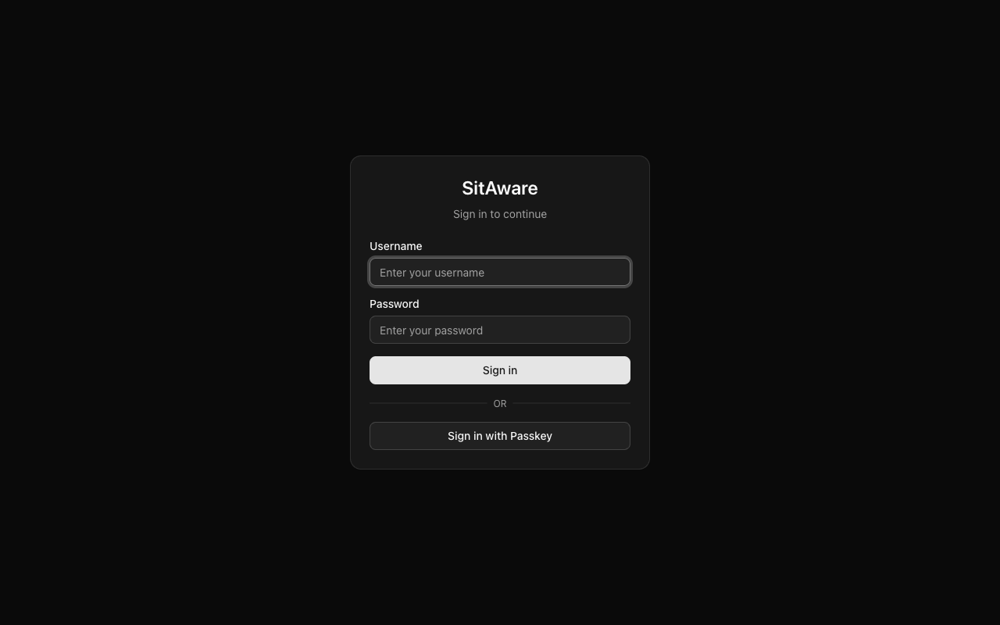

# Getting Started

This guide walks you through your first login and orients you around the SitAware interface.

## Prerequisites

SitAware must be running. If you are deploying it yourself, see the [Quick Start](../../README.md#quick-start) section in the README.

## First Login

1. Open your browser and navigate to your SitAware instance (default: `http://localhost:3000`).
2. You will see the login screen.

3. Enter your username and password. If this is a fresh installation, use the default admin credentials:
   - **Username:** `admin`
   - **Password:** `changeme`
4. Click **Sign in**.

> **Passkey login:** If you have registered a passkey (see [MFA Setup](mfa-setup.md)), you can click **Sign in with Passkey** to authenticate without a password.

## The Dashboard

After logging in, you land on the **Dashboard**.

The dashboard shows:
- **Your identity** -- who you are signed in as, your email, and your role (Admin or User)
- **Quick links** to the Map and Messages sections
- **Connection status** in the top-right corner -- a green dot with "Connected" means the real-time WebSocket connection is active

## Navigation

The top navigation bar is always visible and provides access to the main sections:

| Link | Description |
|---|---|
| **Dashboard** | Overview and quick stats |
| **Map** | Real-time situational awareness map |
| **Streams** | Live video streams and recordings |
| **Messages** | Group and direct messaging |

Your avatar/initials appear in the top-right corner. Click it to access:
- **Account Settings** -- profile, security, devices, activity, groups
- **Server Settings** -- (admin only) users, groups, map config, stream keys, security, audit logs
- **Sign Out**

## Connection Status

The green indicator in the header shows your real-time connection status:
- **Connected** (green dot) -- WebSocket is active, you are receiving live updates
- **Disconnected** (red/no dot) -- connection lost, the client will automatically attempt to reconnect

## Key Concepts

### Users and Roles
- **Admin** -- full access to everything, including user management and server configuration
- **User** -- standard access, limited to their own groups and data

### Groups
Groups are how teams are organized. You must be a member of a group to see its members' locations and messages. Each group membership has permissions:
- **Can Read** -- see group members' locations and messages
- **Can Write** -- send messages and share your location to the group
- **Group Admin** -- manage members within the group

### Devices
A device represents an endpoint you use to access SitAware (e.g., your laptop browser, a phone, a tablet). Devices are auto-registered when you log in from a web browser. One device can be marked as **Primary**.

## Next Steps

- [Using the Map](map.md) -- learn about location markers, drawing tools, replay, and measurement
- [Messaging](messaging.md) -- send group and direct messages with file attachments
- [Location Sharing](location-sharing.md) -- enable and manage real-time location sharing
- [Live Streaming](live-streaming.md) -- broadcast and watch live video, GPS-synced recordings
- [MFA Setup](mfa-setup.md) -- secure your account with multi-factor authentication
- [Account Settings](account-settings.md) -- customize your profile, avatar, and map marker
- [Admin Guide](admin-guide.md) -- (admins) manage users, groups, map sources, stream keys, and audit logs
