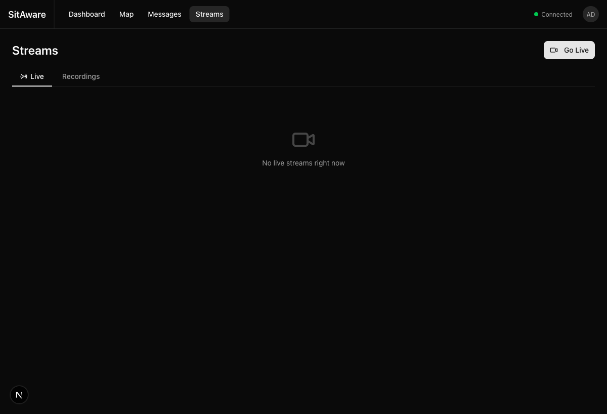

# Live Streaming

SitAware supports live video streaming from browsers and hardware devices (drones, CCTV, body cams, vehicle cameras). Streams are shared with groups and appear as clickable markers on the map. Recordings are saved for after-action review with GPS-synced playback.

## Streams Page

Navigate to **Streams** in the top navigation bar.

The Streams page has two tabs:
- **Live** -- currently active streams from all groups you belong to
- **Recordings** -- ended streams with saved recordings

Each stream card shows:
- **Title** and broadcaster name
- **Source type** -- camera/screen (browser) or device (RTSP/RTMP)
- **LIVE badge** (pulsing) for active streams
- **Start time** or recording date

Click a stream card to open the viewer.

## Broadcasting from Your Browser

You can broadcast live video from your camera or screen directly in the browser.

1. Click the **Go Live** button on the Streams page (or in the Live Streams panel on the Map).
2. The Broadcast dialog opens.

### Setting Up the Broadcast

1. **Select a source** -- click **Camera** to use your webcam/phone camera, or **Screen** to share your screen.
2. Grant browser permission when prompted (camera/microphone or screen share).
3. A live preview appears in the dialog.
4. Enter a **Title** for your stream.
5. **Select groups** to share the stream with -- click group badges to toggle selection. At least one group is required.
6. Click **Go Live**.

### While Broadcasting

- A **LIVE** badge and elapsed timer appear on the video preview.
- Your GPS location is broadcast at 1Hz alongside the video (if location permission is granted). Other users see your stream as a moving marker on the map.
- The dialog cannot be closed while live -- you must end the stream first.
- Click **End Stream** to stop broadcasting. Media tracks are released and the recording is saved.

## Watching a Live Stream

### From the Streams Page

1. Navigate to **Streams**.
2. Click on any stream card with a **LIVE** badge.
3. The stream viewer dialog opens and connects via WebRTC (WHEP).
4. If the connection fails, click **Retry** to reconnect.

### From the Map

Live streams with known GPS positions appear as pulsing red markers on the map.

1. Locate the red pulsing marker (labeled with the stream title).
2. Click the marker to open the stream viewer.
3. Hover over the marker to see a popup with the stream title, broadcaster, and source type.

## Watching a Recording

1. Navigate to **Streams** and click the **Recordings** tab.
2. Click a recording card.
3. The viewer opens with standard video controls (play, pause, seek, volume).

### GPS-Synced Playback

Recordings that have GPS data support synced playback on the map. As the video plays back, a marker on the map moves in sync with the video timeline, showing the broadcaster's position at each moment. This is useful for after-action review of patrols, drone flights, or vehicle routes.

## Live Streams Panel on the Map

The Map page includes a **Live Streams** panel that lists all currently active streams.

- The panel shows a count badge and each stream's title, broadcaster, and source type.
- Click any stream in the list to open the viewer.
- Click **Go Live** at the top of the panel to start your own broadcast.

## Stream Markers on the Map

Active streams are represented as pulsing red dot markers on the map at the broadcaster's GPS position. The marker updates in real-time as the broadcaster moves. When a stream ends, the marker is automatically removed.

## Hardware Device Streaming

Hardware devices (CCTV cameras, body cams, drones, vehicle cameras) can publish video via RTSP or RTMP using stream keys. This does not require a user account or browser session.

### How It Works

1. An administrator generates a **stream key** in Server Settings (see [Admin Guide -- Stream Key Management](admin-guide.md#stream-key-management)).
2. The stream key is configured on the hardware device as the RTSP/RTMP password.
3. When the device starts streaming, MediaMTX authenticates the stream key against the SitAware API.
4. The stream automatically appears in the groups configured for that key.

### Device Configuration

Configure your device to publish to:

| Protocol | URL |
|---|---|
| **RTSP** | `rtsp://<server>:8554/<path>` |
| **RTMP** | `rtmp://<server>:1935/<path>` |

- **Username**: any value (e.g., `device`)
- **Password**: the stream key

The `<path>` can be any unique identifier for this device (e.g., `front-gate-cam`).

## Deleting a Stream

1. On the Streams page, click the action menu (**...**) on a stream card.
2. Select **Delete**.
3. Confirm the deletion.

Deleting a stream removes the stream record and its associated recording file. This action cannot be undone.

## Permissions

- You can only see streams that are shared with groups you belong to (with read permission).
- You can only broadcast to groups you have write permission in.
- Administrators can see and manage all streams.
- Stream key management is restricted to administrators.

## Troubleshooting

| Issue | Solution |
|---|---|
| Camera/screen not available | Check that you granted browser permissions for camera, microphone, or screen sharing. |
| "Failed to connect" when viewing | The stream may have ended or the media server may be unreachable. Click **Retry** or refresh the page. |
| No stream markers on the map | The broadcaster may not have location permission enabled, or the stream has no GPS data. |
| Hardware device not connecting | Verify the RTSP/RTMP URL, stream key, and that the MediaMTX server is reachable on the correct port. |
| Recording not available | Recording is saved when the stream ends. If the stream was interrupted (server restart), the recording may be incomplete. |
