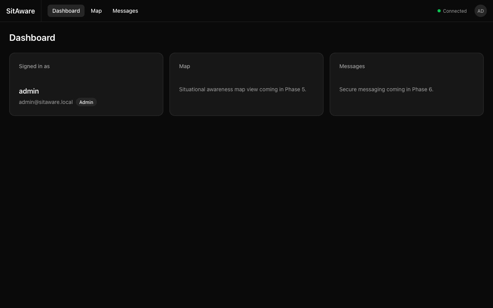
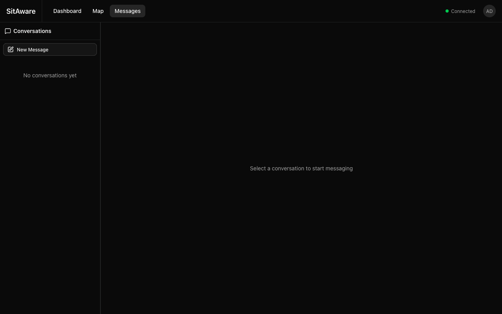
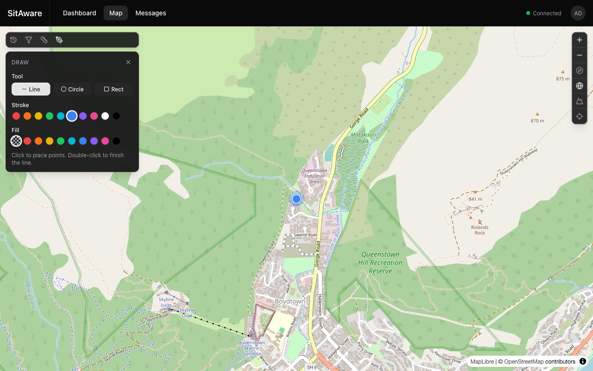

# Vincenty

> **vincenty** /ˈvɪn.sɛn.ti/ — The Vincenty formulae, developed by Polish-American geodesist
> Thaddeus Vincenty (1920–2002), are the algorithms that calculate precise distances between
> two coordinates on the surface of an ellipsoidal Earth. Used in every GPS receiver, mapping
> platform, and navigation system that needs accurate real-world measurements. Vincenty's work
> is why your phone knows exactly how far you are from where you need to be.

A modern, lightweight situational awareness platform. Built as an alternative to TAK Server for teams that need real-time location tracking, secure messaging, and map-based coordination — deployable to the cloud or fully air-gapped environments with zero internet dependency.

## Why Vincenty?

TAK Server is powerful but heavy — complex to deploy, tightly coupled to specific clients, and difficult to run in constrained environments. Vincenty takes a different approach:

- **Lightweight** — Go API with minimal dependencies, distroless container images
- **Air-gap ready** — No CDN calls, no external fonts, local tile serving. Works on an isolated network with `docker compose up`
- **Modern clients** — Browser-based web UI and native iOS app with real-time maps, chat, and admin tools
- **Cloud native** — Runs on Docker Compose, Kubernetes, or AWS ECS Fargate
- **Simple operations** — All configuration via environment variables, automatic database migrations, admin bootstrap on first start

## Screenshots

<div class="grid" markdown>

{ width="400" }
{ width="400" }
{ width="400" }
{ width="400" }

</div>

## Quick Start

Prerequisites: [Docker](https://docs.docker.com/get-docker/) and [Docker Compose](https://docs.docker.com/compose/install/)

```bash
git clone https://github.com/hayward-solutions/vincenty.git
cd vincenty
make dev
```

This starts the full stack:

| Service | URL | Purpose |
|---|---|---|
| Web Client | http://localhost:3000 | Browser UI |
| API | http://localhost:8080 | REST + WebSocket API |
| PostgreSQL | localhost:5432 | Database (PostGIS) |
| Redis | localhost:6379 | Pub/sub messaging |
| Minio Console | http://localhost:9001 | Object storage (dev only) |

Default admin credentials: `admin` / `changeme`

## Tech Stack

| Component | Technology |
|---|---|
| API | Go (stdlib `net/http`), no framework |
| Database | PostgreSQL 16 + PostGIS |
| Pub/Sub | Redis (pluggable — interface supports Kafka, Apache Ignite) |
| Object Storage | S3-compatible (Minio for dev, AWS S3 for production) |
| Real-time | WebSocket ([nhooyr.io/websocket](https://github.com/nhooyr/websocket)) |
| Auth | JWT access tokens + rotating refresh tokens + long-lived API tokens |
| Web Client | Next.js (App Router, standalone output) |
| CLI Client | Go (streams GPX/GeoJSON tracks over WebSocket) |
| iOS Client | SwiftUI (iOS 17+, Swift 6.0, MVVM + Observation) |
| UI (Web) | shadcn/ui, Tailwind CSS v4, Radix UI |
| Maps | MapLibre GL JS (web), MapLibre Native SDK (iOS) |
| Containers | Multi-stage Docker (distroless for API, node-slim for web) |

## License

[MIT](https://github.com/hayward-solutions/vincenty/blob/main/LICENSE)
